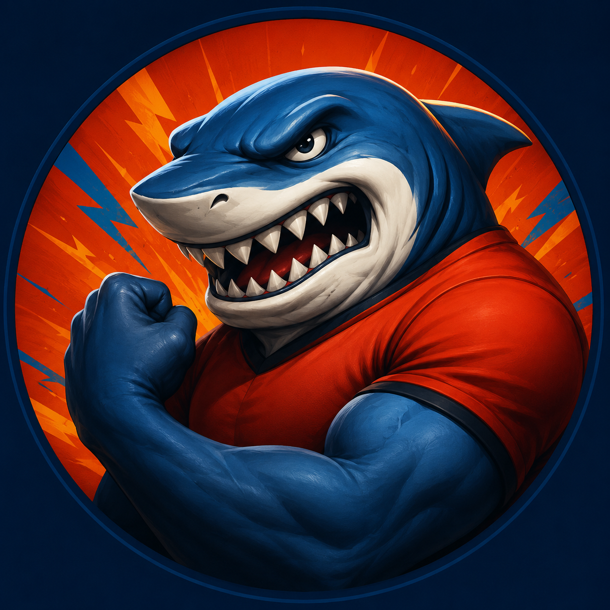

# Plano de Implementação: Apresentação de Fechamento (Categorias e Loja Perfeita)

Este documento detalha o passo a passo, estruturação de banco de dados, HTML e lógicas JavaScript para implementar os dois novos slides solicitados pelo Gerente de Vendas: **Disputa de Categorias (Águia vs Shark)** e **Histórico Loja Perfeita**.

---

## 1. Banco de Dados (PostgreSQL / Supabase)

Para evitar que a separação das equipes (Águia e Shark) fique engessada ("hardcoded") no código JavaScript, precisamos criar uma tabela de configuração no banco e atualizar a função que alimenta a apresentação.

### 1.1 Tabela de Configuração de Equipes
Execute este script no SQL Editor do Supabase para criar a tabela que vincula o `codsupervisor` à sua respectiva equipe:

```sql
CREATE TABLE IF NOT EXISTS public.config_equipes (
    codsupervisor text PRIMARY KEY,
    equipe text NOT NULL
);

ALTER TABLE public.config_equipes ENABLE ROW LEVEL SECURITY;
GRANT SELECT ON public.config_equipes TO anon, authenticated;

-- Inserindo os mapeamentos padrão
INSERT INTO public.config_equipes (codsupervisor, equipe) VALUES
    ('12', 'SHARK'),
    ('18', 'ÁGUIA'),
    ('1', 'ÁGUIA'),
    ('21', 'ÁGUIA')
ON CONFLICT (codsupervisor) DO UPDATE SET equipe = EXCLUDED.equipe;
```

### 1.2 Atualização da RPC `get_closing_presentation_data`
Na sua RPC principal de fechamento, você precisa adicionar CTEs (Common Table Expressions) para calcular as métricas de disputa por categoria e os top vendedores de cada equipe.

**Novas CTEs a serem inseridas antes do `SELECT json_build_object` final:**
```sql
    -- 1. Base de Categorias filtrada pelas equipes
    , categorias_base AS (
        SELECT
            ce.equipe, ds.codusur, dp.categoria, ds.codcli, ds.ano, ds.mes, ds.vlvenda, ds.peso, ds.codfor
        FROM public.data_summary ds
        JOIN public.dim_produtos dp ON ds.produto = dp.codigo
        JOIN public.config_equipes ce ON LTRIM(ds.codsupervisor::text, '0') = ce.codsupervisor
        WHERE ds.ano IN ($1, $5, $7, $9)
          AND dp.categoria IS NOT NULL AND dp.categoria != ''
    )
    -- 2. Agregação bruta da Disputa
    , categorias_disputa_raw AS (
        SELECT
            cb.categoria, cb.equipe, cb.ano, cb.mes,
            SUM(cb.vlvenda) as faturamento, SUM(cb.peso) as tonelada, COUNT(DISTINCT cb.codcli) as posituacoes
        FROM categorias_base cb
        GROUP BY cb.categoria, cb.equipe, cb.ano, cb.mes
    )
    -- 3. Separação de Mês Atual vs Média do Trimestre Anterior
    , categorias_disputa_aggregated AS (
        SELECT
            categoria, equipe,
            SUM(CASE WHEN ano = $1 AND mes = $2 THEN faturamento ELSE 0 END) as fat_atual,
            SUM(CASE WHEN ano = $1 AND mes = $2 THEN tonelada ELSE 0 END) as ton_atual,
            SUM(CASE WHEN ano = $1 AND mes = $2 THEN posituacoes ELSE 0 END) as pos_atual,
            SUM(CASE WHEN (ano = $5 AND mes = $6) OR (ano = $7 AND mes = $8) OR (ano = $9 AND mes = $10) THEN faturamento ELSE 0 END) / 3.0 as fat_trim,
            SUM(CASE WHEN (ano = $5 AND mes = $6) OR (ano = $7 AND mes = $8) OR (ano = $9 AND mes = $10) THEN tonelada ELSE 0 END) / 3.0 as ton_trim,
            SUM(CASE WHEN (ano = $5 AND mes = $6) OR (ano = $7 AND mes = $8) OR (ano = $9 AND mes = $10) THEN posituacoes ELSE 0 END) / 3.0 as pos_trim
        FROM categorias_disputa_raw
        GROUP BY categoria, equipe
    )
    -- 4. Top Vendedores (Focados em quantas categorias positivaram)
    , vendedores_categorias AS (
        SELECT
            cb.equipe, MAX(dv.nome) as vendedor, cb.codusur,
            COUNT(DISTINCT cb.categoria) as categorias_distintas,
            SUM(cb.vlvenda) as faturamento, SUM(cb.peso) as tonelada, COUNT(DISTINCT cb.codcli) as posituacoes
        FROM categorias_base cb
        LEFT JOIN public.dim_vendedores dv ON LTRIM(cb.codusur::text, '0') = dv.codigo
        WHERE cb.ano = $1 AND cb.mes = $2
        GROUP BY cb.equipe, cb.codusur
    )
    -- 5. KPI de Salty (Fornecedores Específicos)
    , kpi_salty AS (
        SELECT
            cb.equipe, COUNT(DISTINCT cb.codcli) as clientes_salty
        FROM categorias_base cb
        WHERE cb.ano = $1 AND cb.mes = $2 AND LTRIM(cb.codfor::text, '0') IN ('707', '708', '752')
        GROUP BY cb.equipe
    )
```

E no retorno final do JSON (`json_build_object`), adicione estas 3 chaves:
```sql
        'categorias_disputa', (SELECT COALESCE(json_agg(row_to_json(a)), '[]'::json) FROM categorias_disputa_aggregated a),
        'vendedores_categorias', (SELECT COALESCE(json_agg(row_to_json(a)), '[]'::json) FROM vendedores_categorias a),
        'kpi_salty', (SELECT COALESCE(json_agg(row_to_json(a)), '[]'::json) FROM kpi_salty a)
```

---

## 2. Frontend: Estrutura HTML (`presentation.html`)

Substitua a estrutura do slide antigo de "Por Atacado" pelos dois novos slides.

### Slide: Disputa de Categorias
```html
<div class="swiper-slide h-full overflow-y-auto custom-scrollbar pb-10">
  <div class="flex justify-between items-center border-b border-fuchsia-500/30 pb-2 mb-6 sticky top-0 bg-[#07050e] z-10 pt-2">
    <div class="section-title mb-0">Disputa de Categorias</div>
    <div class="flex space-x-2" id="categorias-metric-filters">
        <button class="px-3 py-1 text-xs font-semibold rounded bg-[#fc0100] text-white transition-all metric-btn" data-metric="geral">Geral</button>
        <button class="px-3 py-1 text-xs font-semibold rounded bg-white/5 text-slate-300 transition-all metric-btn" data-metric="faturamento">Faturamento</button>
        <button class="px-3 py-1 text-xs font-semibold rounded bg-white/5 text-slate-300 transition-all metric-btn" data-metric="tonelada">Tonelada</button>
        <button class="px-3 py-1 text-xs font-semibold rounded bg-white/5 text-slate-300 transition-all metric-btn" data-metric="posituacao">Positivação</button>
    </div>
  </div>

  <div id="presentation-categorias-content" class="flex flex-col gap-6">
     <!-- Indicadores Principais (KPIs) -->
     <div id="categorias-kpis" class="grid grid-cols-4 gap-4 mb-4"></div>

     <!-- Ranking de Share % -->
     <div class="card p-4 rounded-xl">
         <h3 class="text-sm font-bold text-white mb-4">Ranking de Share (Participação Atual)</h3>
         <div id="categorias-share-ranking" class="flex flex-col gap-2"></div>
     </div>

     <!-- Top Vendedores (Shark vs Águia) -->
     <div class="grid grid-cols-2 gap-6">
         <div class="card p-4 rounded-xl border border-blue-500/30 bg-blue-900/10">
             <h3 class="text-sm font-bold text-blue-400 mb-4 flex justify-between">Top Vendedores Shark </h3>
             <div id="categorias-sellers-shark" class="flex flex-col gap-3"></div>
         </div>
         <div class="card p-4 rounded-xl border border-red-500/30 bg-red-900/10">
             <h3 class="text-sm font-bold text-red-400 mb-4 flex justify-between">Top Vendedores Águia </h3>
             <div id="categorias-sellers-aguia" class="flex flex-col gap-3"></div>
         </div>
     </div>

     <!-- Crescimento vs Trimestre -->
     <div class="card p-4 rounded-xl mt-2">
         <h3 class="text-sm font-bold text-white mb-4 flex justify-between">Crescimento vs Trimestre <span id="growth-metric-label" class="text-xs">Métrica: Geral</span></h3>
         <div id="categorias-growth-ranking" class="flex flex-col gap-4"></div>
     </div>
  </div>
</div>
```

### Slide: Histórico Loja Perfeita
Deve ser inserido logo após o slide acima.
```html
<div class="swiper-slide h-full flex flex-col">
  <div class="flex justify-between items-center border-b border-fuchsia-500/30 pb-2 mb-6">
    <div class="section-title mb-0">Loja Perfeita Histórico</div>
    <div class="flex items-center space-x-3">
      <label class="text-xs text-slate-400">Supervisor:</label>
      <select id="loja-perfeita-supervisor-filter" class="bg-[#0f0e13] border border-white/10 rounded-lg px-2 text-white"><option value="">Todos</option></select>
      <label class="text-xs text-slate-400 ml-2">Pesquisador:</label>
      <select id="loja-perfeita-pesquisador-filter" class="bg-[#0f0e13] border border-white/10 rounded-lg px-2 text-white"><option value="">Todos</option></select>
    </div>
  </div>
  <div class="flex-grow relative w-full h-[600px] card p-4 rounded-xl">
      <div id="loja-perfeita-loading" class="absolute inset-0 bg-[#07050e]/80 flex items-center justify-center z-10 hidden">Carregando...</div>
      <canvas id="lojaPerfeitaChart"></canvas>
  </div>
</div>
```

---

## 3. Frontend: Lógica JavaScript (`src/js/presentation.js`)

### 3.1 Disputa de Categorias
Crie uma função `renderCategoriasDispute(data, activeMetric)` que faça os seguintes passos lógicos:
1. **Cálculo de Crescimento:** Faça um loop em `data.categorias_disputa`. Para cada categoria e equipe, calcule a porcentagem de crescimento em Faturamento, Tonelada e Positivação em relação ao `trimestre` (fórmula: `(atual - trim) / trim * 100`).
2. **Definição da Métrica Ativa:** Se o usuário clicar no botão "Faturamento", use apenas o crescimento de faturamento. Se for "Geral", some as porcentagens das três métricas (Fat + Ton + Pos) para gerar o "score de crescimento".
3. **Cálculo dos KPIs:** Leia `data.kpi_salty` para mostrar os clientes Salty. Faça uma contagem cruzada para descobrir quantas categorias a equipe Shark possui Share > 50% (ex: Fat da Shark / Fat Total da Categoria) contra a Águia, e vice versa. Renderize isso via `innerHTML` na div `#categorias-kpis`.
4. **Ranking de Vendedores:** Ordene a matriz `data.vendedores_categorias` primeiro por **maior quantidade de categorias distintas vendidas**, e depois use Faturamento como critério de desempate. Imprima os 3 primeiros que pertencem a Shark na div `#categorias-sellers-shark` e os da Águia em `#categorias-sellers-aguia`.
5. **Eventos dos Botões:** Adicione um `.addEventListener('click')` aos botões `.metric-btn`. Quando clicados, atualizam a cor do botão (para destacar qual está ativo), alteram a variável `activeMetric` e invocam o `renderCategoriasDispute(data, novaMetrica)` novamente para redesenhar a tela.

### 3.2 Gráfico Loja Perfeita (Chart.js)
Crie uma função `initLojaPerfeitaSlide()`:
1. **Filtros Dinâmicos:** Utilize a API do Supabase no client-side para buscar uma lista distinta de Supervisores e Pesquisadores da tabela `data_nota_perfeita`: `supabase.from('data_nota_perfeita').select('supervisor').not('supervisor', 'is', null)`. Preencha os `select` do HTML com esses dados.
2. **Busca Histórica (6 Meses):** Como a função `get_loja_perfeita_data` recebe um mês específico, faça um loop criando um array de `Promises` (usando `Promise.all`) iterando pelos últimos 6 meses.
3. **Cálculo da Média:** Para cada mês retornado, some a `pontuacao_geral` de todos os clientes e divida pela quantidade de visitas válidas para obter a Média Geral daquele mês.
4. **Renderização:** Destrua a instância do `lojaPerfeitaChartInstance` se ela já existir. Instancie um novo `new Chart(...)` apontando para o Canvas e passando os 6 meses no eixo X e as notas médias no eixo Y.
5. **Reatividade:** Adicione um ouvinte `change` nos selects de Supervisor/Pesquisador para que toda vez que forem alterados, a função busque novamente as `Promises` passando os filtros, e atualize o gráfico.

### 3.3 Inicialização
Dentro da sua função principal que invoca a RPC (`loadData()` ou similar), não se esqueça de inicializar tudo:
```javascript
// Exemplo de como plugar no código existente:
const { data: rpcData, error } = await supabase.rpc("get_closing_presentation_data", {...});

renderCategoriasDispute(rpcData, 'geral');
initLojaPerfeitaSlide();
```
